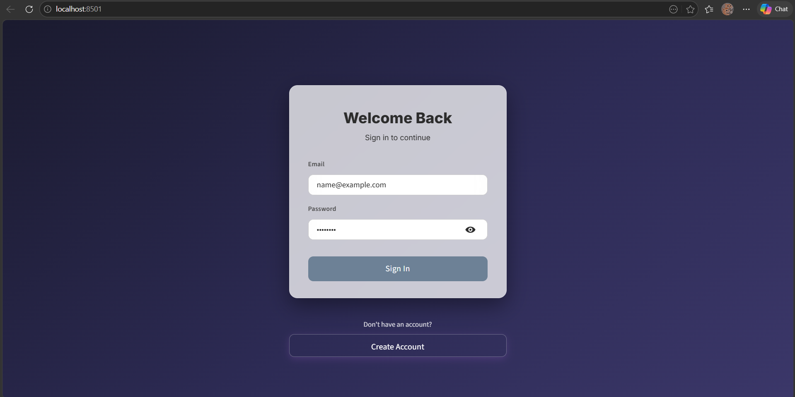
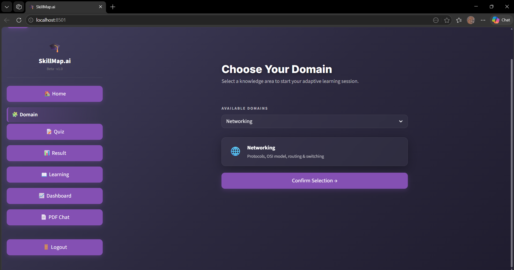
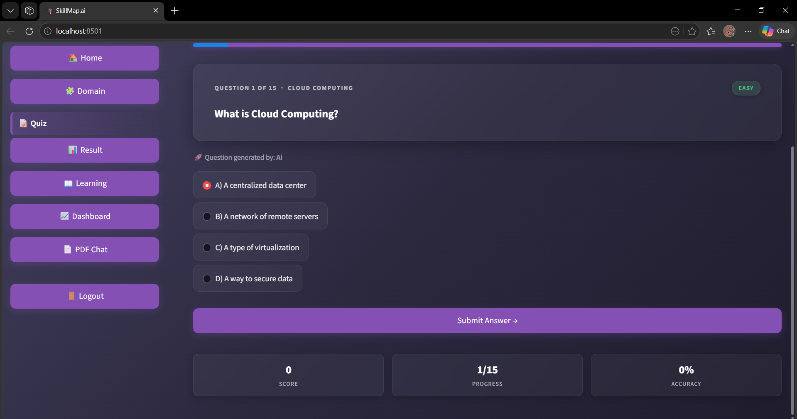
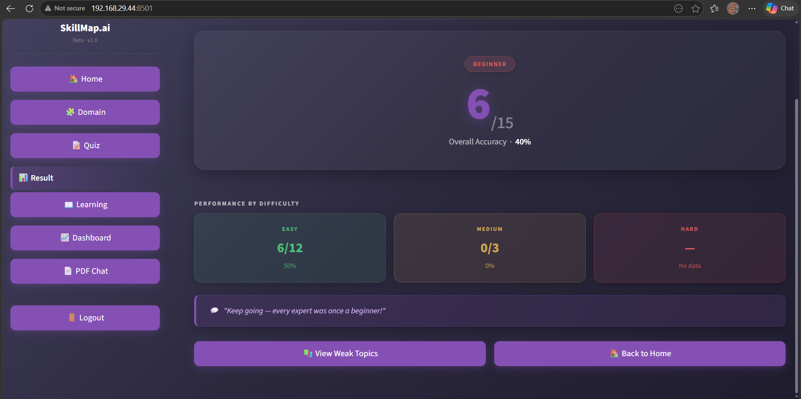
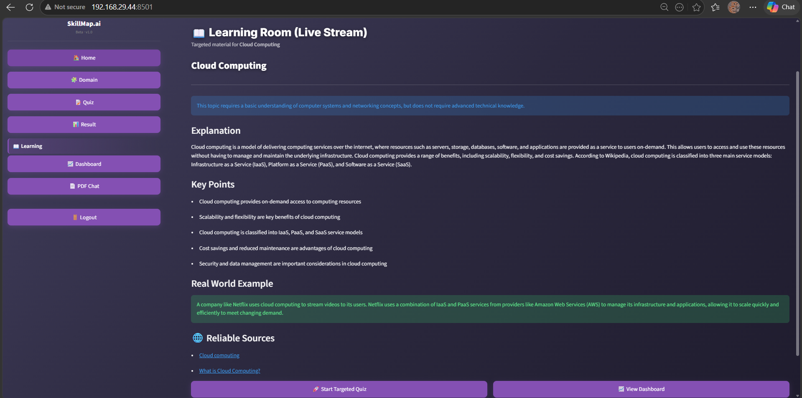
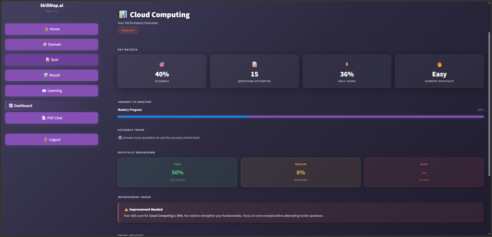
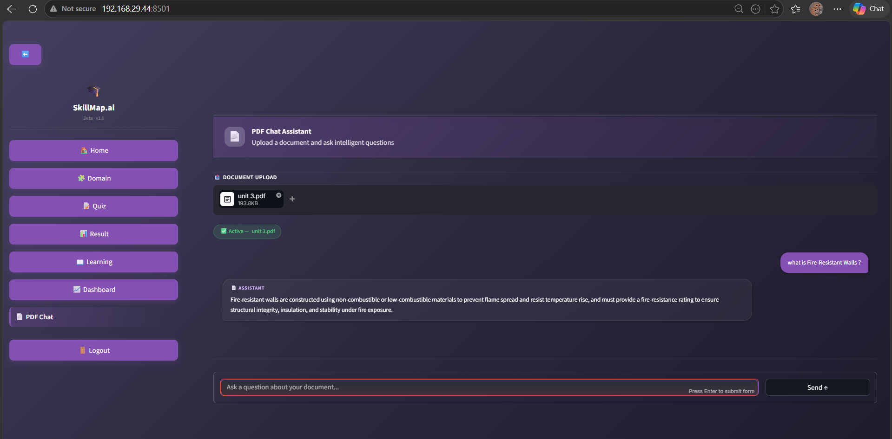

# 🎓 SkillMap.ai — Agentic Adaptive Learning System

> *Stop studying everything. Start fixing what you don't know.*


---

## 🧩 The Problem

Most learners study passively — reading notes, re-watching videos, hoping it sticks.  
They have no idea which topics they actually struggle with — until the real exam.

**The result?** Time wasted reviewing things they already know, while real weaknesses go undetected.

## 💡 The Solution

**SkillMap.ai** is an AI-powered learning system that:

1. **Quizzes you adaptively** — difficulty changes in real time based on how well you're doing
2. **Detects your weak spots** — tracks which topics you consistently get wrong
3. **Generates targeted learning content** — AI writes personalized explanations just for you
4. **Tracks your progress** — a live dashboard shows your performance over time
5. **Lets you chat with PDFs** — upload any study material and ask questions about it

Think of it as a smart tutor that knows exactly where you're struggling — and fixes it.

---

## 👥 Who Is This For?

| Audience | Use Case |
|---|---|
| 🎓 Students | Exam prep, concept revision |
| 💼 Job Seekers | Technical interview practice |
| 🔬 Self-Learners | Structured domain learning |
| 🧑‍🏫 Educators | Understanding learner gaps |

---

## ⚙️ How It Works — Step by Step

```
1. Login          → Authenticate into your personal learning session
         ↓
2. Pick a Domain  → Choose: Networking, AI & ML, Cloud Computing, Business Analyst
         ↓
3. Confirm Domain → Click "Confirm Selection" — this gates access to the quiz
         ↓
4. Take the Quiz  → Answer 15 adaptive MCQs, generated 2 at a time by AI
                    Questions are buffered: AI fetches the next batch in the
                    background so the quiz never pauses
         ↓
5. Submit Answer  → Each answer graded instantly, explanation shown,
                    score and accuracy cards update live
         ↓
6. View Results   → Score, overall accuracy, and per-difficulty breakdown
                    (Easy / Medium / Hard) shown on the results page
         ↓
7. AI Generates   → Personalized learning content for your weak areas
   Learning
         ↓
8. Dashboard      → Visual analytics, history, downloadable report
```

### 🔄 Adaptive Difficulty Engine

Every quiz **starts at Easy** and adjusts automatically based purely on your answer streaks:

| Condition | Action |
|---|---|
| ✅ 2 correct answers in a row | Increase difficulty: Easy → Medium → Hard |
| ❌ 2 wrong answers in a row | Decrease difficulty: Hard → Medium → Easy |
| No streak triggered | Keep current difficulty |

**Boundaries are enforced** — difficulty cannot go above Hard or below Easy.

When a streak threshold is hit, **both streaks are reset to 0** so the next transition requires a fresh 2-answer run. Each question's difficulty is color-coded on the card: 🟢 Easy, 🟡 Medium, 🔴 Hard.

All performance is tracked per-difficulty level (`diff_scores`) and shown as a breakdown on the Results page.

---
## 🧠 AI-Based Adaptive Quiz System

## 📌 Overview

This project implements an adaptive quiz system where question difficulty dynamically changes based on user performance. The system also classifies users into skill levels (Beginner, Intermediate, Expert) based on accuracy.

---

## 🔄 Adaptive Difficulty Logic

The quiz adjusts difficulty using *streak-based adaptation*:

* ✅ 2 consecutive correct answers → Increase difficulty
* ❌ 2 consecutive wrong answers → Decrease difficulty
* Otherwise → Maintain current level

### 📊 Example Flow

| Q | Level  | Answer  | Streak | Next Level |
| - | ------ | ------- | ------ | ---------- |
| 1 | Medium | Correct | C=1    | Medium     |
| 2 | Medium | Correct | C=2 🔥 | Hard       |
| 3 | Hard   | Wrong   | W=1    | Hard       |
| 4 | Hard   | Wrong   | W=2 🔥 | Medium     |
| 5 | Medium | Wrong   | W=1    | Medium     |
| 6 | Medium | Wrong   | W=2 🔥 | Easy       |

---

## ⚙️ Difficulty Transition Rules

* Easy → Medium → Hard (increase)
* Hard → Medium → Easy (decrease)
* Difficulty remains within bounds (Easy–Hard)

---

## 🎯 Performance Evaluation

After completing the quiz, user performance is evaluated using accuracy.

### 🧮 Accuracy Calculation

python
accuracy = int(score / TOTAL * 100)

<<<<<<< HEAD

=======
>>>>>>> 34178c2 (Added image folder and updated README file)
---

## 🏆 Skill Level Classification

Users are categorized into levels based on accuracy:

python
if accuracy <= 40:
    level = "Beginner"
elif accuracy <= 70:
    level = "Intermediate"
else:
    level = "Expert"


### 📊 Classification Table

| Accuracy Range | Level        |
| -------------- | ------------ |
| 0% – 40%       | Beginner     |
| 41% – 70%      | Intermediate |
| 71% – 100%     | Expert       |

---

## 💡 Key Features

* 🔁 Adaptive difficulty based on performance streaks
* 🧠 AI-generated quiz questions
* 📊 Real-time performance tracking
* 🏆 Skill level classification
* 🎨 Interactive and user-friendly UI
<<<<<<< HEAD
=======

---

>>>>>>> 34178c2 (Added image folder and updated README file)
## ✨ Features

### 🧠 Adaptive Quiz Engine
15-question quizzes that **start at Easy** difficulty and adjust automatically using streak-based logic. The AI generates questions **2 at a time** via the FastAPI backend, buffering the next pair in the background so there's no wait between questions. Each question shows: question text, 4 labeled options (A/B/C/D), the correct answer, and a styled explanation box on submission.

### 📊 Live Stats Bar
Below each question a row of **3 glass-card chips** shows your running Score, Progress (e.g. `3/15`), and Accuracy % — all updating in real time without leaving the quiz.

### 📈 Per-Difficulty Breakdown
For every question answered, the system records **correct and total counts per difficulty level** (`Easy / Medium / Hard`). The Results page displays this as a color-coded 3-card grid so you can instantly see where you struggled.

### 🔍 Weak Topic Detection
After each quiz, the system automatically identifies which topics had the lowest accuracy and flags them for targeted learning.

### 📖 AI-Generated Learning Content
For each weak topic, the AI writes a personalized explanation, key points, and real-world example — tailored to your performance level (Beginner / Intermediate / Expert).

### 📄 PDF Chat (RAG)
Upload any PDF (textbook, notes, docs). The system embeds it into ChromaDB and lets you ask natural language questions about its content. Answers are pulled directly from the document.

### 📊 Performance Dashboard
A visual analytics page showing your quiz history, score trends, accuracy by difficulty, topic breakdowns, and a downloadable Markdown performance report.

### 🤖 Eduna — Floating AI Assistant
A context-aware chatbot always accessible on every page. Ask it anything — concept explanations, study tips, quiz guidance.

### 🔐 User Authentication
Secure login/register system with per-user session isolation. Your progress is always saved to your own account.

---

## 🏗️ System Architecture

```
┌─────────────────────────────────────────────────────┐
│                  Browser / Client                    │
│              Streamlit Frontend (app.py)              │
│   Home │ Domain │ Quiz │ Result │ Learn │ Dashboard  │
└───────────────────────┬─────────────────────────────┘
                        │ HTTP (REST)
                        ▼
┌─────────────────────────────────────────────────────┐
│              FastAPI Backend (api/)                  │
│   /generate-questions  /generate-learning  /stream  │
└──────┬──────────────────────────────┬───────────────┘
       │                              │
       ▼                              ▼
┌─────────────┐               ┌──────────────────────┐
│   Ollama    │  (local LLM)  │     Groq API         │
│   llama3    │◄── fallback ──│  (cloud LLM backup)  │
└─────────────┘               └──────────────────────┘
       │
       ▼
┌─────────────────────────────────────────────────────┐
│              Services Layer (services/)              │
│  ai_service │ rag_service │ pdf_service │ prompts   │
└──────┬─────────────────────────┬────────────────────┘
       │                         │
       ▼                         ▼
┌─────────────┐          ┌───────────────┐
│  SQLite DB  │          │   ChromaDB    │
│ (users.db)  │          │ (PDF vectors) │
└─────────────┘          └───────────────┘
```

---

## 🛠️ Tech Stack

| Layer | Technology | Purpose |
|---|---|---|
| **Frontend** | Streamlit | Interactive UI, navigation, session state |
| **Backend** | FastAPI + Uvicorn | REST API, async endpoints |
| **Primary AI** | Ollama (llama3) | Local LLM — fast, private, free |
| **Fallback AI** | Groq API | Cloud LLM when Ollama is unavailable |
| **Vector Store** | ChromaDB | PDF embedding storage and retrieval |
| **Embeddings** | sentence-transformers | Convert PDF chunks to vectors |
| **PDF Parsing** | PyPDF | Extract and chunk PDF content |
| **Database** | SQLite | User accounts and quiz history |
| **Validation** | Pydantic | Strict schema enforcement for AI output |
| **HTTP Client** | HTTPX + Requests | Async API calls |

---

## 🚀 Installation Guide

### Prerequisites

Before you start, make sure you have:

- Python **3.10 or higher** → [Download](https://python.org)
- [Ollama](https://ollama.com/download) installed and running
- A free [Groq API key](https://console.groq.com) (used as fallback)

---

### Step 1 — Clone the Repository

```bash
git clone https://github.com/your-username/skillmap-ai.git
cd skillmap-ai
```

### Step 2 — Create a Virtual Environment

```bash
# Create
python -m venv venv

# Activate (Windows)
venv\Scripts\activate

# Activate (macOS / Linux)
source venv/bin/activate
```

### Step 3 — Install All Dependencies

```bash
pip install -r requirements.txt
```

### Step 4 — Set Up Environment Variables

Create a `.env` file in the project root:

```env
GROQ_API_KEY=your_groq_api_key_here
```

### Step 5 — Pull the AI Model

```bash
ollama pull llama3
```

> If Ollama is not running, start it with: `ollama serve`

### Step 6 — Start the Backend

Open **Terminal 1**:

```bash
uvicorn api.main:app --reload --port 8000
```

You should see:  
`✅ Uvicorn running on http://127.0.0.1:8000`

### Step 7 — Start the Frontend

Open **Terminal 2** (virtual environment active):

```bash
streamlit run app.py
```

Your browser will open automatically at `http://localhost:8501` 🎉

---

## 🎮 Usage Guide

### Full User Journey

| Step | What To Do |
|---|---|
| **1. Register / Login** | Create your account on the login page |
| **2. Select a Domain** | Choose your subject: Networking, AI & ML, Cloud, or Business Analyst |
| **3. Confirm Domain** | Click "Confirm Selection" to lock in your choice |
| **4. Start Quiz** | Click "Start Quiz" — 15 adaptive questions begin |
| **5. Answer Questions** | Choose A/B/C/D for each — get instant feedback + explanation |
| **6. View Results** | See your score, accuracy, weak topics breakdown |
| **7. Study Learning Content** | Navigate to Learning — AI generates content for weak areas |
| **8. Check Dashboard** | Track your progress over time, download reports |
| **9. Chat with PDF** | Upload a PDF and ask questions about its content |

### Tips

- 💡 **Change Domain** anytime from the Domain page — the quiz resets automatically
- 📄 **PDF Chat** works best with textbooks, notes, or documentation files
- 🤖 **Ask Eduna** (the floating assistant) if you're stuck on any concept

---

## 📸 Screenshots

<<<<<<< HEAD
=======
### 🔐 Login Page

>>>>>>> 34178c2 (Added image folder and updated README file)

### 🧩 Domain Selection


### 📝 Quiz in Progress


### 📊 Results Page


### 📖 AI Learning Content


### 📈 Performance Dashboard


### 📄 PDF Chat


---


## 📁 Project Structure

```
skillmap-ai/
│
├── app.py                    # 🚪 Main entry point — routing & sidebar nav
│
├── api/                      # ⚡ FastAPI backend
│   ├── main.py               # App factory, CORS, router registration
│   └── routes/
│       ├── quiz.py           # GET /generate-questions
│       ├── learn.py          # POST /generate-learning
│       └── stream.py         # GET /stream (SSE)
│
├── services/                 # 🧠 AI & data services
│   ├── ai_service.py         # Ollama ↔ Groq orchestrator with failover
│   ├── ollama_service.py     # Local Ollama LLM client
│   ├── groq_service.py       # Groq cloud API client
│   ├── rag_service.py        # ChromaDB embed → query pipeline
│   ├── pdf_service.py        # PDF parsing and chunking
│   └── prompts.py            # All LLM prompt templates
│
├── views/                    # 🖼️ Streamlit page modules
│   ├── auth.py               # Login / registration
│   ├── home.py               # Landing page
│   ├── domain.py             # Domain selection + confirmation
│   ├── quiz.py               # Adaptive quiz engine
│   ├── result.py             # Results + weak topic analysis
│   ├── learning.py           # AI-generated learning content
│   ├── dashboard.py          # Performance analytics
│   ├── pdf_chat.py           # PDF upload + RAG Q&A
│   ├── eduna_chat.py         # Floating AI assistant
│   └── styles.py             # Global CSS design system
│
├── chroma_db/                # 🗄️ ChromaDB vector store (auto-created)
├── users.db                  # 🗄️ SQLite database (auto-created)
├── requirements.txt          # 📦 Python dependencies
├── .env                      # 🔑 API keys (not committed to git)
└── .gitignore
```

---

## 🔮 Future Improvements

- [ ] **More Domains** — Cybersecurity, DevOps, Data Engineering, System Design
- [ ] **Spaced Repetition** — Smart scheduling to review weak topics at optimal intervals
- [ ] **Leaderboard** — Compare scores with other learners
- [ ] **Mobile-Responsive UI** — Better experience on phones and tablets
- [ ] **Voice Mode** — Answer quiz questions by speaking
- [ ] **Browser Extension** — Quiz yourself while reading any webpage
- [ ] **Progress Certificates** — Generate completion certificates after domain mastery
- [ ] **Multi-language Support** — Content in languages other than English

---

## 🤝 Contributing
Authors Sivabalan And SanjeeviRam.

## Authors : 
  **sivabalan** And **SanjeeviRam**.

Contributions are welcome and appreciated!

1. **Fork** this repository
2. **Create** a branch: `git checkout -b feature/your-feature-name`
3. **Make** your changes with clear, commented code
4. **Test** that nothing is broken
5. **Commit**: `git commit -m "feat: add your feature description"`
6. **Push**: `git push origin feature/your-feature-name`
7. **Open** a Pull Request

Please keep your PR focused — one feature or fix per PR.

---

## 📄 License

This project is licensed under the **MIT License**.  
You are free to use, modify, and distribute this software.

---

<div align="center">

**Built with ❤️ using Streamlit, FastAPI & Llama 3**

*SkillMap.ai — Know your gaps. Close them fast.*

⭐ If this project helped you, consider giving it a star!

</div>
